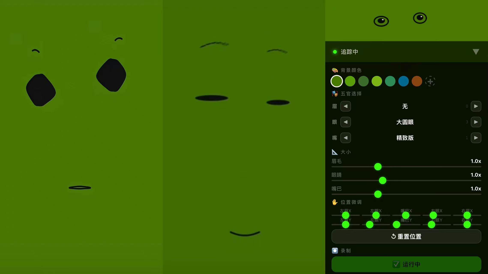

# face-swap

Real-time AR face replacement in the browser — powered by MediaPipe Face Mesh, HTML5 Canvas, and WebRTC.

Single HTML file. No build step. Just open it in a browser. Mobile browser better.

**🎭 Try it live → https://thesammylab.github.io/tools/face-swap/**

## Features

- Dual-person face replacement — detect and swap two faces simultaneously
- Expressive cartoon facial features — adaptive rendering that tracks facial expressions
- Adaptive EAR calibration — works for users with naturally small eyes
- Face deduplication — shape fingerprinting prevents double detection
- Drag-to-reposition UI — tweak placement with your finger or mouse
- Built-in recording — capture your creations via MediaRecorder API
- iOS Safari friendly — optimized for mobile browsers

---

## Quick start

Just open index.html in a browser. Mobile brower better.  That is it.

For local development, any static file server works:

    python3 -m http.server 8000

Then visit http://localhost:8000

Note: Webcam access requires HTTPS (or localhost). If you are deploying to a server, make sure you have HTTPS enabled.

---

## iOS Safari note

There is a known WebKit bug where recorded videos may have timestamp issues when imported directly into video editors like CapCut (剪映).

Workaround: After recording, save the video to iPhone Photos first, then re-export from Photos before importing to your editor. This rewrites the timestamps correctly.

---

## Tech stack

- MediaPipe Face Mesh — face landmark detection
- HTML5 Canvas — rendering
- WebRTC getUserMedia — camera access
- MediaRecorder API — video recording

No frameworks. No build tools. Just vanilla JavaScript in a single HTML file.

---

## License

AGPL-3.0 — see LICENSE in the repository root.

Commercial licensing available — reach out at https://www.sammylab.com.
